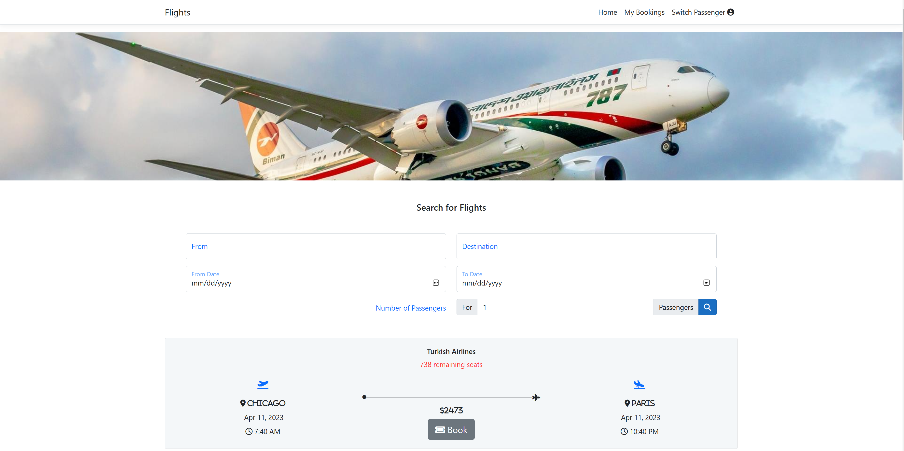

# Flights

Flights is a full-stack web development application with implemented navigation, routing, & form validations where users can search, filter, & book different flights based on departure locations, destinations, departure-arrival dates, & number of passengers. Users can also sign-in and sign-out of individual accounts, where they can view and/or cancel their bookings.

The application utilizes Angular to build the frontend, ASP.NET to build the backend, and Microsoft SQL Server as the database for data storage and retrieval.

## Video Walkthroughs

Here's a walkthrough of implemented user stories:

